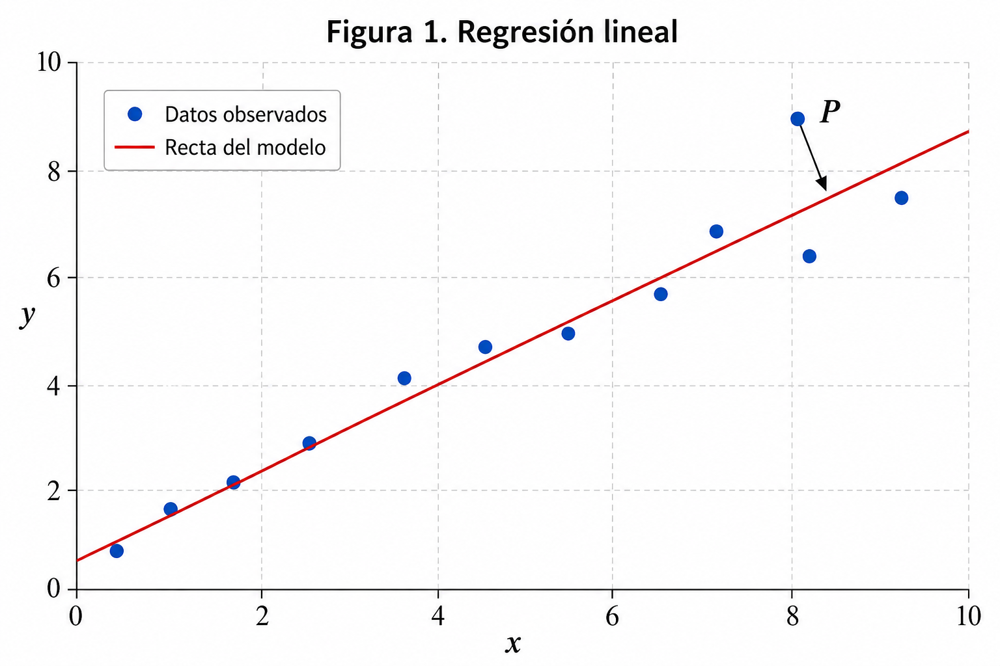

# Taller 1 — Fundamentos de Deep Learning

## Objetivo

Aplicar los conceptos fundamentales de regresión, clasificación, funciones de costo, gradiente, descenso del gradiente, funciones de activación, *backpropagation* y entrenamiento de redes neuronales.

> **Instrucciones:** Justifique sus respuestas cuando se solicite. El objetivo del taller no es únicamente realizar cálculos, sino interpretar el comportamiento de los modelos y su proceso de entrenamiento.

---

# 1. Regresión lineal

Se está entrenando un modelo de regresión lineal:

$$
\hat{y} = wx + b
$$

La siguiente figura muestra los datos y la recta obtenida por el modelo.



En la figura se ha señalado el punto $P$.

### Preguntas

1. ¿La predicción del modelo $\hat{y}$ para el punto $P$ es mayor o menor que el valor real $y$?

2. Si definimos el residuo como:

$$
e = y - \hat{y}
$$

¿el residuo correspondiente al punto $P$ es positivo o negativo?

3. Si utilizamos el error cuadrático:

$$
L = (y - \hat{y})^2
$$

¿puede la función de costo tomar un valor negativo? Justifique.

4. ¿Qué debería ocurrir con la recta del modelo durante el entrenamiento para reducir el costo global?

---

# 2. Regresión logística y frontera de decisión

La siguiente figura representa un problema de clasificación binaria.


El modelo calcula:

$$
z = w_1x_1 + w_2x_2 + b
$$

y posteriormente:

$$
\hat{y} = \sigma(z)
$$

El modelo clasifica una observación como clase 1 cuando:

$$
\hat{y} \geq 0.5
$$

### Preguntas

1. ¿Cuál de los puntos señalados, $P_1$ o $P_2$, está incorrectamente clasificado?

2. ¿Qué representa geométricamente la línea punteada?

3. Sobre la frontera de decisión:

$$
w_1x_1+w_2x_2+b=0
$$

¿qué valor tiene $z$?

4. ¿Qué valor tiene $\sigma(z)$ sobre la frontera?

5. El vector:

$$
\mathbf{w}
==========

\begin{bmatrix}
w_1\
w_2
\end{bmatrix}
$$

es perpendicular a la frontera de decisión.

¿Qué representa la dirección hacia la cual apunta $\mathbf{w}$ con respecto al valor de $z$?

6. Suponga que para una observación:

$$
z=3
$$

Sin calcular exactamente la función sigmoide, ¿esperaría que fuera clasificada como clase 0 o clase 1? Justifique.

---

# 3. Gradiente y función de costo

La siguiente figura representa la función de costo $J(w)$ de un modelo.


Se muestran tres posiciones diferentes del parámetro $w$: **A**, **B** y **C**.

### Punto A

1. ¿El gradiente

$$
\frac{\partial J}{\partial w}
$$

es positivo, negativo o aproximadamente cero?

2. Para reducir $J$, ¿deberíamos aumentar o disminuir $w$?

### Punto B

3. ¿El gradiente es positivo, negativo o aproximadamente cero?

4. Para reducir $J$, ¿deberíamos aumentar o disminuir $w$?

### Punto C

5. ¿Qué valor aproximado debería tener el gradiente?

6. ¿Por qué este punto es importante durante el proceso de optimización?

---

# 4. Actualización de parámetros

Un modelo tiene actualmente el parámetro:

$$
w=3
$$

Durante *backpropagation* se obtiene:

$$
\frac{\partial J}{\partial w}=-4
$$

y se utiliza un *learning rate*:

$$
\eta=0.1
$$

La regla de actualización es:

$$
w_{\text{nuevo}}
================

w-\eta\frac{\partial J}{\partial w}
$$

### Preguntas

1. Calcule el nuevo valor de $w$.

2. ¿El parámetro aumentó o disminuyó?

3. Explique por qué la dirección del cambio tiene sentido teniendo en cuenta el signo del gradiente.

4. Suponga ahora que utilizamos:

$$
\eta=0.001
$$

¿Qué efecto tendría sobre el tamaño de la actualización?

5. ¿Un *learning rate* más pequeño garantiza necesariamente un mejor entrenamiento? Justifique.

---

# 5. Efecto del Learning Rate

Tres modelos idénticos fueron entrenados utilizando diferentes valores de *learning rate*.


Las curvas **A**, **B** y **C** muestran la evolución de la función de costo.

### Preguntas

1. ¿Cuál modelo probablemente utiliza un *learning rate* demasiado pequeño?

2. ¿Cuál parece utilizar un *learning rate* adecuado?

3. ¿Cuál probablemente utiliza un *learning rate* demasiado grande?

4. Explique por qué un *learning rate* demasiado grande puede impedir alcanzar un mínimo de la función de costo.

5. ¿Por qué un *learning rate* demasiado pequeño puede ser problemático aunque el *loss* esté disminuyendo?

---

# 6. Transformaciones lineales y funciones de activación

Considere las siguientes redes.

### Red A

`Entrada → Linear₁ → Linear₂ → Linear₃ → Salida`

### Red B

`Entrada → Linear₁ → ReLU → Linear₂ → ReLU → Linear₃ → Salida`

Considere inicialmente dos transformaciones lineales consecutivas:

$$
z_1=W_1x+b_1
$$

$$
z_2=W_2z_1+b_2
$$

### Preguntas

1. Sustituya $z_1$ en la expresión de $z_2$.

2. Reorganice la expresión resultante para obtener una expresión de la forma:

$$
z_2=Wx+b
$$

3. Explique por qué varias transformaciones lineales consecutivas sin funciones de activación son equivalentes a una única transformación lineal.

4. ¿Qué aportan las funciones de activación a una red neuronal?

5. ¿Cuál de las dos redes puede representar relaciones no lineales más complejas? Justifique.

---

# 7. Backpropagation manual

Considere el siguiente grafo computacional:

```text
       ×2           cuadrado           +3          cuadrado

x ─────────► a ─────────────► b ─────────► c ───────────► L
```

Las operaciones son:

$$
a=2x
$$

$$
b=a^2
$$

$$
c=b+3
$$

$$
L=c^2
$$

Para esta observación:

$$
x=1
$$

## Parte A — Forward pass

1. Calcule:

$$
a,\qquad b,\qquad c,\qquad L
$$

## Parte B — Derivadas locales

Las derivadas locales son:

$$
\frac{\partial a}{\partial x}=2
$$

$$
\frac{\partial b}{\partial a}=2a
$$

$$
\frac{\partial c}{\partial b}=1
$$

$$
\frac{\partial L}{\partial c}=2c
$$

2. Utilizando los valores obtenidos durante el *forward pass*, calcule el valor numérico de cada derivada local.

## Parte C — Backpropagation

Comience desde el final del grafo.

Calcule:

$$
\frac{\partial L}{\partial c}
$$

Luego:

$$
\frac{\partial L}{\partial b}
=============================

\frac{\partial L}{\partial c}
\frac{\partial c}{\partial b}
$$

Continúe con:

$$
\frac{\partial L}{\partial a}
=============================

\frac{\partial L}{\partial b}
\frac{\partial b}{\partial a}
$$

Finalmente:

$$
\frac{\partial L}{\partial x}
=============================

\frac{\partial L}{\partial a}
\frac{\partial a}{\partial x}
$$

### Preguntas

3. ¿Cuál es el valor final de $\frac{\partial L}{\partial x}$?

4. ¿Qué representa este valor?

5. ¿Por qué durante *backpropagation* se multiplican las derivadas locales?

6. Identifique en el ejercicio cuáles valores fueron calculados durante el **forward pass** y cuáles durante el **backward pass**.

---

# 8. Softmax y Cross-Entropy desde los logits

Un modelo de clasificación multiclase tiene **tres clases** y produce los siguientes logits para una observación:

$$
z=
\begin{bmatrix}
2.0 & 1.0 & 0.1
\end{bmatrix}
$$

La etiqueta verdadera es:

$$
y=0
$$

La función Softmax está definida como:

$$
p_k
===

\frac{e^{z_k}}
{\sum_{j=1}^{C}e^{z_j}}
$$

Puede utilizar:

$$
e^{2.0}\approx7.39
$$

$$
e^{1.0}\approx2.72
$$

$$
e^{0.1}\approx1.11
$$

### Preguntas

1. Calcule:

$$
\sum_j e^{z_j}
$$

2. Calcule las probabilidades:

$$
p_0,\qquad p_1,\qquad p_2
$$

3. Verifique que:

$$
p_0+p_1+p_2\approx1
$$

4. ¿Qué clase predice el modelo?

5. ¿La predicción es correcta?

Para una observación, la función Cross-Entropy puede calcularse como:

$$
L=-\log(p_y)
$$

donde $p_y$ es la probabilidad asignada a la clase verdadera.

Puede utilizar:

$$
\log(0.66)\approx-0.42
$$

6. Calcule el costo de esta observación.

7. Ahora suponga que otro modelo produce:

$$
z=
\begin{bmatrix}
0.2 & 0.3 & 2.5
\end{bmatrix}
$$

pero la etiqueta verdadera continúa siendo:

$$
y=0
$$

Sin realizar todos los cálculos exactamente, ¿esperaría un costo mayor o menor que en el primer caso? Justifique.

---

# 9. Curvas de entrenamiento

Se entrenó una red neuronal durante 100 épocas.


La figura muestra el **Training Loss** y el **Validation Loss**.

### Preguntas

1. ¿Está aprendiendo el modelo durante las primeras épocas? ¿Qué evidencia observa?

2. ¿Qué ocurre aproximadamente después de la época 50–60?

3. ¿Continuar disminuyendo el *Training Loss* significa necesariamente que el modelo está mejorando su capacidad de predecir datos nuevos?

4. ¿En qué región de la gráfica consideraría razonable seleccionar el modelo final?

5. ¿Cómo se denomina el fenómeno en el cual el modelo continúa mejorando sobre los datos de entrenamiento pero comienza a empeorar sobre los datos de validación?

6. Explique brevemente la diferencia entre **aprender los datos de entrenamiento** y **generalizar**.

---

# 10. Full Batch, SGD y Mini-Batch

Tenemos un conjunto de datos con:

$$
N=10,000
$$

observaciones.

Se consideran tres estrategias.

### Estrategia A

Se utilizan las **10 000 observaciones** para calcular el gradiente antes de realizar una actualización de los parámetros.

### Estrategia B

Se utiliza **una sola observación** antes de cada actualización.

### Estrategia C

Se utilizan grupos de **32 observaciones** antes de cada actualización.

### Preguntas

1. Identifique cuál estrategia corresponde a:

   * Full Batch Gradient Descent
   * Stochastic Gradient Descent
   * Mini-Batch Gradient Descent

2. ¿Cuántas actualizaciones de parámetros realiza aproximadamente la estrategia A durante una época?

3. ¿Cuántas actualizaciones realiza aproximadamente la estrategia B durante una época?

4. Para la estrategia C, estime el número de actualizaciones realizadas durante una época.

5. ¿En cuál estrategia espera que la estimación del gradiente presente mayor variabilidad entre actualizaciones?

6. ¿Cuál estrategia es normalmente utilizada para entrenar redes neuronales modernas?

7. Explique al menos una ventaja de utilizar *mini-batches*.

---

## Para pensar

Considere el ciclo general de entrenamiento:

```text
Datos
  │
  ▼
Forward Pass
  │
  ▼
Predicción
  │
  ▼
Función de costo
  │
  ▼
Backpropagation
  │
  ▼
Gradientes
  │
  ▼
Actualización de parámetros
  │
  └──────────────────► repetir
```

Explique con sus propias palabras cómo este proceso permite que una red neuronal aprenda a partir de los datos.

